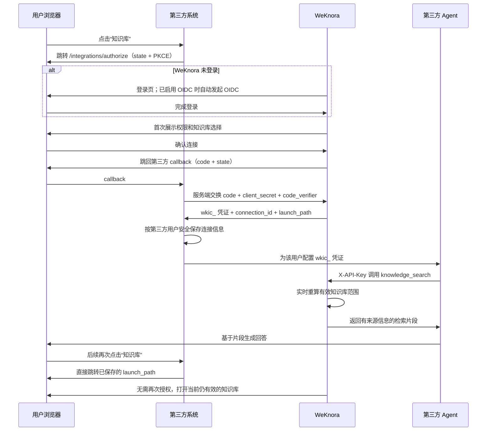

# 第三方系统一键登录与知识库 Agent 接入交接文档

本文面向第三方系统的后端、前端和 Agent/MCP 接入人员，说明如何完成：

- 从第三方系统一键进入用户自己的 WeKnora 知识库；
- 首次连接时由用户确认权限，后续无感打开；
- 使用独立的用户连接凭证，通过 REST、MCP 或 Skill 检索已授权知识库；
- 在多个第三方应用并存时保持用户、空间和知识库权限隔离。

## 1. 核心约定

| 项目 | 约定 |
| --- | --- |
| WeKnora 登录 | 继续使用现有登录和单个 OIDC Provider；第三方应用注册可以有多个 |
| 浏览器连接协议 | 授权码 + PKCE S256 + confidential client secret |
| 第三方 Agent 凭证 | 长期有效的 `wkic_...` 用户连接凭证 |
| Agent 请求头 | `X-API-Key: wkic_...` |
| 默认权限 | `knowledge.read` |
| 可选权限 | `knowledge.chat`，同时隐含 `knowledge.read` |
| 权限计算 | 用户连接授权 ∩ 当前空间策略 ∩ 应用当前配置 ∩ 用户当前访问权 |
| 连接撤销 | 用户撤销后立即失效，不等待缓存或 Token 到期 |
| MCP 部署 | 每个用户连接使用独立进程或容器，不在共享进程中切换多个用户凭证 |

`wkic_` 不是登录 Token、OIDC Token 或浏览器 JWT。它只能由第三方服务端或用户本机 MCP 进程保存，不能返回第三方浏览器前端。

## 2. 整体流程



## 3. WeKnora 管理端配置

### 3.1 注册第三方应用

由 WeKnora 系统管理员进入“设置 → 第三方应用”，创建一个应用并配置：

- 应用名称和说明；
- 一个或多个精确回调地址；
- 可申请的 Scope；
- 是否启用。

创建后会返回：

- `client_id`，前端授权跳转时使用；
- `client_secret`，只显示一次，只能存放在第三方服务端。

生产回调地址必须使用 HTTPS。开发环境仅允许 `http://localhost` 或回环 IP。回调地址按完整字符串精确匹配，路径、端口和查询参数都必须与注册值一致。

应用可以注册多个，因此同一个 WeKnora 实例可以同时接入多个第三方系统。现有 OIDC Provider 仍只负责 WeKnora 用户登录，不需要为每个第三方应用新增一套 OIDC 配置。

### 3.2 配置空间策略

空间管理员可进入“设置 → 第三方连接”，对每个应用进一步限制：

- 是否允许在当前空间使用；
- 当前空间允许的 Scope；
- 当前空间允许被用户授权的知识库。

未创建空间策略时，默认允许应用配置中的 Scope，并允许用户从自己当前可访问的全部知识库中选择。策略中的知识库列表留空也表示“不额外限制”，不是“拒绝全部”。

## 4. 第三方浏览器接入

### 4.1 生成 PKCE 参数

第三方服务端为每次连接生成：

- `state`：不可预测、一次性，并绑定当前第三方登录用户和预期 WeKnora 空间；
- `code_verifier`：43 至 128 个 RFC 7636 unreserved 字符；
- `code_challenge`：`BASE64URL_NO_PADDING(SHA256(code_verifier))`。

示例 Node.js 代码：

```js
import crypto from 'node:crypto'

const state = crypto.randomBytes(32).toString('base64url')
const codeVerifier = crypto.randomBytes(48).toString('base64url')
const codeChallenge = crypto
  .createHash('sha256')
  .update(codeVerifier)
  .digest('base64url')

// 将 state、codeVerifier、当前第三方用户 ID、预期空间 ID 和创建时间保存在服务端会话中。
```

### 4.2 跳转授权页

浏览器跳转到：

```text
https://WEKNORA_ORIGIN/integrations/authorize
  ?client_id=wkapp_xxx
  &redirect_uri=https%3A%2F%2Fthird.example.com%2Fweknora%2Fcallback
  &state=STATE
  &scope=knowledge.read
  &code_challenge=CHALLENGE
  &code_challenge_method=S256
  &tenant_id=12
```

需要 WeKnora 问答能力时，Scope 使用空格分隔：

```text
scope=knowledge.read%20knowledge.chat
```

如果用户未登录，WeKnora 会记住完整授权地址并进入登录流程；部署启用 OIDC 时会自动发起现有 OIDC 登录。登录完成后返回授权页。首次连接展示确认页，用户选择至少一个知识库后完成授权。

`tenant_id` 是可选参数。第三方已明确知道目标 WeKnora 空间时应传入；WeKnora 会切换到该空间后再读取授权范围。未传时使用用户当前空间。第三方服务端必须只使用自己已保存、与当前第三方用户绑定的空间 ID，不能直接信任浏览器提交的任意值。

同一应用、空间和用户已有有效连接，且请求 Scope 没有扩大时，授权页会自动复用原连接并直接回调，不再重复确认。

### 4.3 校验回调

成功回调：

```text
https://third.example.com/weknora/callback?code=wkac_xxx&state=STATE
```

用户拒绝：

```text
https://third.example.com/weknora/callback?error=access_denied&state=STATE
```

第三方服务端必须：

1. 用常量时间方式校验 `state` 与服务端会话一致；
2. 确认 `state` 未使用且未超时；
3. 只在服务端继续交换授权码；
4. 无论成功失败，都立即删除本次 `state` 和 `code_verifier`。

交换成功后还要校验响应中的 `tenant_id` 与本次 `state` 绑定的预期空间一致；不一致时不得保存凭证。

### 4.4 交换用户连接凭证

请求：

```http
POST /api/v1/integrations/token
Content-Type: application/x-www-form-urlencoded

grant_type=authorization_code&
client_id=wkapp_xxx&
client_secret=wks_xxx&
code=wkac_xxx&
redirect_uri=https%3A%2F%2Fthird.example.com%2Fweknora%2Fcallback&
code_verifier=VERIFIER
```

也支持等价 JSON 请求。成功响应：

```json
{
  "access_token": "wkic_xxx",
  "token_type": "API-Key",
  "connection_id": "0d2c1ff4-1b55-4d98-9830-f056ccb9e643",
  "tenant_id": 12,
  "launch_path": "/integrations/launch/0d2c1ff4-1b55-4d98-9830-f056ccb9e643?tenant_id=12",
  "scopes": ["knowledge.read"]
}
```

授权码有效期为 5 分钟且只能使用一次。对同一连接再次成功交换授权码时，旧 `wkic_` 凭证会被撤销，因此第三方必须原子替换保存的凭证。

建议按以下唯一键保存：

```text
(third_party_user_id, weknora_application/client_id, weknora_tenant_id)
```

至少保存 `access_token`、`connection_id`、`tenant_id`、`launch_path`、`scopes` 和更新时间。`access_token` 应进入密钥管理系统或加密列，不写日志、不写分析事件、不进入浏览器 Cookie/localStorage。

### 4.5 后续无感打开

后续用户点击“知识库”时，第三方前端直接跳转：

```text
https://WEKNORA_ORIGIN{launch_path}
```

必须使用 Token 响应中原样返回的 `launch_path`，其中包含连接所属空间。WeKnora 会校验当前登录用户就是连接所有者，并实时显示仍在有效授权范围内的知识库：

- 只有一个知识库时直接打开；
- 有多个知识库时展示选择页；
- 没有有效知识库时展示空状态；
- 未登录时先完成登录，再回到该地址。

## 5. 第三方 Agent REST 接入

### 5.1 跨知识库搜索

推荐第三方 Agent 使用不带知识库 ID 的跨库检索：

```http
POST /api/v1/knowledge-search
X-API-Key: wkic_xxx
Content-Type: application/json

{
  "query": "退款审批需要哪些材料？"
}
```

省略 `knowledge_base_ids` 时，仅对 `wkic_` 集成凭证自动使用该连接当前的完整有效范围。普通 JWT 或普通 API Key 仍需明确提供搜索目标。

如需主动缩小本次搜索范围，可传有效范围的子集：

```json
{
  "query": "退款审批需要哪些材料？",
  "knowledge_base_ids": ["kb-id-1", "kb-id-2"]
}
```

传入任何未授权知识库 ID 都会返回 403。接口返回检索片段和来源元数据，不进行 LLM 总结，第三方 Agent 应基于这些片段回答并保留来源引用。

### 5.2 其他读取接口

`knowledge.read` 可访问现有的知识库、知识、Chunk 和 Wiki 读取/检索接口。所有调用仍使用同一个请求头：

```http
X-API-Key: wkic_xxx
```

不要发送 `Authorization: Bearer wkic_xxx`。`wkic_` 是 API Key，不是 Bearer Token。

### 5.3 可选问答权限

应用、空间策略、用户连接三层都包含 `knowledge.chat` 时，凭证才会获得现有 chat 能力。该权限只允许创建该连接隔离的会话和执行问答，不授予模型、Agent、知识库或内容管理权限。

如果只需要第三方 Agent 自己生成答案，保持默认 `knowledge.read` 即可。

## 6. MCP 接入

### 6.1 推荐：独立 Python MCP

使用 `mcp-server` 目录中的 MCP 服务，并为每个用户连接启动独立进程：

```json
{
  "mcpServers": {
    "weknora": {
      "command": "uv",
      "args": [
        "--directory",
        "/path/WeKnora/mcp-server",
        "run",
        "run_server.py"
      ],
      "env": {
        "WEKNORA_BASE_URL": "https://kb.example.com/api/v1",
        "WEKNORA_API_KEY": "wkic_xxx"
      }
    }
  }
}
```

检测到 `wkic_` 后，MCP 自动只注册以下读取工具：

- `list_knowledge_bases`
- `get_knowledge_base`
- `hybrid_search`
- `knowledge_search`
- `list_knowledge`
- `get_knowledge`
- `list_chunks`
- `wiki_search`
- `wiki_read_page`
- `wiki_index_view`

Agent 应优先调用：

```json
{
  "name": "knowledge_search",
  "arguments": {
    "query": "退款审批需要哪些材料？"
  }
}
```

不要在一个长期运行的共享 MCP 进程内根据请求切换 `WEKNORA_API_KEY`。如果使用 SSE/HTTP 网络传输，除了每进程固定的 `wkic_` 外，还必须设置独立的 `MCP_SERVER_AUTH_TOKEN` 保护 MCP 网络入口。

### 6.2 CLI MCP

CLI 自带的 stdio MCP 也支持跨库搜索：

```bash
export WEKNORA_HOST="https://kb.example.com"
export WEKNORA_API_KEY="wkic_xxx"
weknora mcp serve
```

使用 `knowledge_search` 时可省略 `knowledge_base_ids`。CLI MCP 还会展示 chat 类工具；没有 `knowledge.chat` Scope 时，服务端会拒绝这些调用。

## 7. Skill 接入

项目内置 Skill：

- `cli/skills/weknora-shared/SKILL.md`
- `cli/skills/weknora-rag-search/SKILL.md`

第三方 Agent 运行环境配置：

```bash
export WEKNORA_HOST="https://kb.example.com"
export WEKNORA_API_KEY="wkic_xxx"
```

跨库检索命令：

```bash
weknora api /api/v1/knowledge-search \
  -d '{"query":"退款审批需要哪些材料？"}'
```

Skill 已明确要求：第三方连接使用 `wkic_`，不使用浏览器/OIDC Token；跨库查询不传知识库 ID；结果由调用 Agent 负责总结回答。

## 8. 权限、失效和运维语义

每次 `wkic_` 请求都会重新检查：

1. 用户连接仍为 active；
2. 第三方应用仍启用；
3. 当前空间策略仍启用；
4. Scope 仍存在于连接、应用和空间策略的交集；
5. 用户账号仍启用且仍是该空间成员；
6. 知识库仍在用户授权、空间策略和用户当前访问权的交集内；
7. 跨空间共享知识库仍具有 Viewer 或更高权限。

因此以下操作会立即收紧或终止访问：

- 用户在“设置 → 第三方连接”撤销连接；
- 系统管理员禁用应用；
- 空间管理员禁用应用或收紧 Scope/知识库范围；
- 用户被停用或移出空间；
- 知识库删除、取消共享或降低共享权限。

轮换 `client_secret` 只影响后续授权码交换，不会撤销已经签发的 `wkic_`。如需终止某应用的全部现有连接，应禁用应用；如只终止某个用户，应由该用户撤销连接。

## 9. 接口清单

### 第三方服务端直接使用

| 方法 | 路径 | 鉴权 | 用途 |
| --- | --- | --- | --- |
| `GET` | `/integrations/authorize` | 浏览器 WeKnora 会话 | 授权页入口 |
| `POST` | `/api/v1/integrations/token` | `client_id` + `client_secret` + code + PKCE | 换取 `wkic_` |
| `GET` | `/integrations/launch/{connection_id}?tenant_id=...` | 浏览器 WeKnora 会话 | 后续无感打开 |
| `POST` | `/api/v1/knowledge-search` | `X-API-Key: wkic_...` | 跨有效知识库检索 |

### WeKnora 管理与用户界面使用

| 方法 | 路径 | 最低权限 |
| --- | --- | --- |
| `GET/POST` | `/api/v1/system/admin/integration-applications` | SystemAdmin |
| `PUT` | `/api/v1/system/admin/integration-applications/{id}` | SystemAdmin |
| `POST` | `/api/v1/system/admin/integration-applications/{id}/rotate-secret` | SystemAdmin |
| `GET` | `/api/v1/integrations/applications` | Viewer |
| `GET` | `/api/v1/integrations/knowledge-bases` | Viewer |
| `PUT` | `/api/v1/integrations/applications/{id}/policy` | Admin |
| `GET/POST` | `/api/v1/integrations/authorization` | Viewer |
| `GET` | `/api/v1/integrations/connections` | Viewer |
| `GET/DELETE` | `/api/v1/integrations/connections/{id}` | Viewer，且只能操作自己的连接 |

## 10. 上线检查清单

- 已执行 PostgreSQL `000089` 或 SQLite `000015` 迁移；
- WeKnora 对外地址使用 HTTPS；
- 回调地址与注册值完全一致；
- `client_secret` 和 `wkic_` 存入服务端密钥系统；
- `state` 一次性、校验归属并设置短超时；
- PKCE 固定使用 S256；
- 第三方数据库按用户隔离连接记录；
- 浏览器只拿 `launch_path`，不拿 `wkic_`；
- MCP 每用户连接独立进程/容器；
- Agent 默认调用 `knowledge_search` 并基于返回来源回答；
- 已验证禁用应用、收紧策略、取消共享和用户撤销均立即生效；
- 日志、APM、错误上报和前端埋点均已过滤 `client_secret`、授权码和 `wkic_`。
